# 📘 Pahana Edu – Web-based Billing System

Pahana Edu is a Java EE web application developed for managing a bookshop's billing operations. It allows admin and staff users to handle customers, items, and orders efficiently via a user-friendly interface. The system supports features like login authentication, inventory management, order processing, and real-time billing.

---

## ⚙️ Technologies Used
- Java 11 (Servlets & JSP)
- Apache Tomcat 9
- MySQL Database
- JDBC for database connection
- Maven (Webapp structure)
- HTML, CSS, JavaScript for frontend
- Git & GitHub for version control

---

## 📁 Project Structure

```
billing_system/
│
├── src/main/java/com/pahanaedu/...        # Java source files (Servlets, DAO, Models)
├── src/main/webapp/                       # JSPs and static assets
├── Screenshots/                           # UI Screenshots
├── Database                               # Database Sql
├── pom.xml                                # Maven project config
└── README.md                              # Project description
```

---

## 🔐 User Roles

| Role  | Capabilities |
|-------|--------------|
| Admin | Full access to customers, items, orders, staff |
| Staff | Access to customers, items, orders only |

---

## 🎯 Features

- Login & Logout authentication
- Add/Edit/Delete Customers, Items, Staff
- Place new orders with live price calculations
- Track order history
- Auto-update item stock levels after purchase
- Real-time total and discount calculation
- Responsive dashboard
- Help section for users

---

## 🧪 Sample Screenshots

### 📌 Login Page
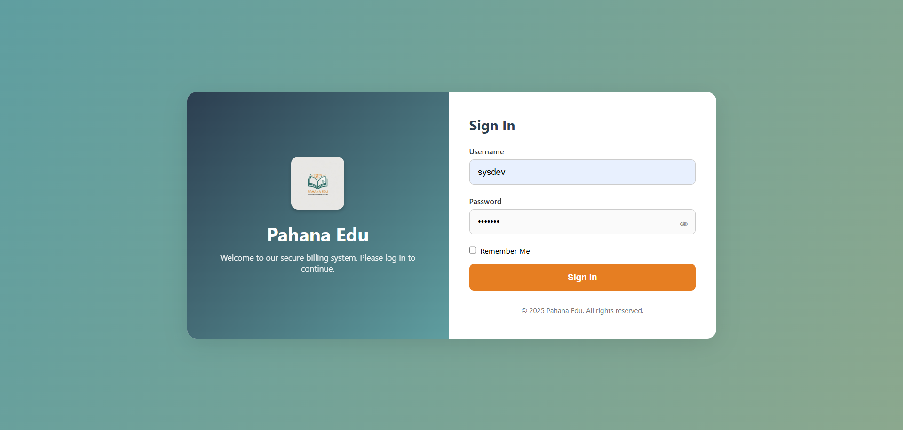

### 📌 Dashboard
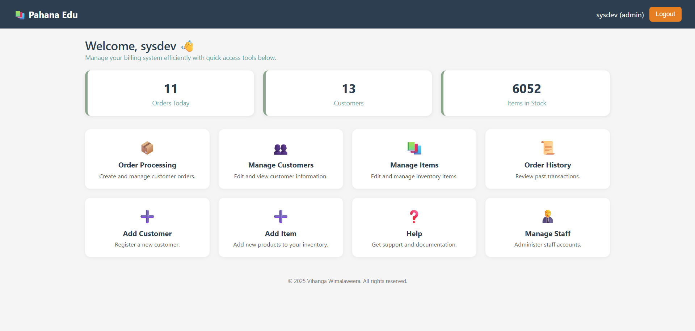

### 📌 Add Customer
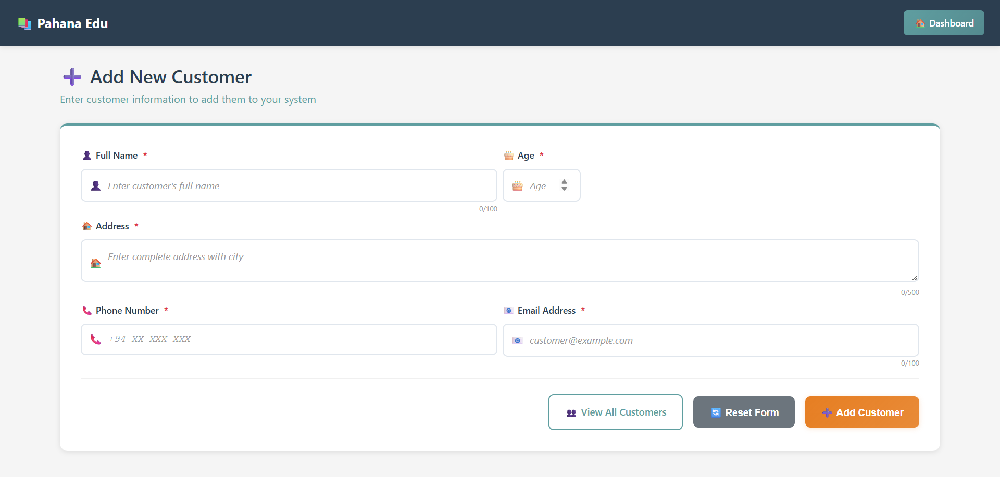

### 📌 Update Customer
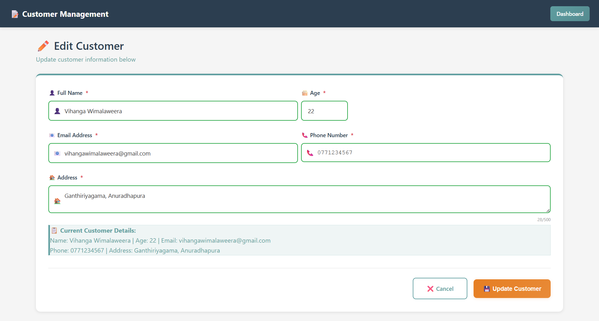

### 📌 Manage Customers
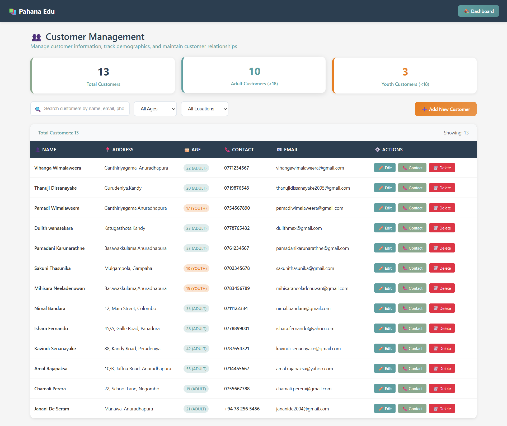

### 📌 Add Item
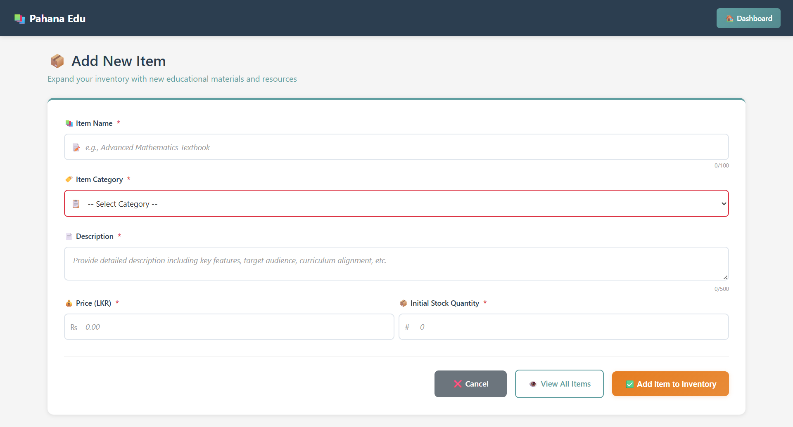

### 📌 Update Item
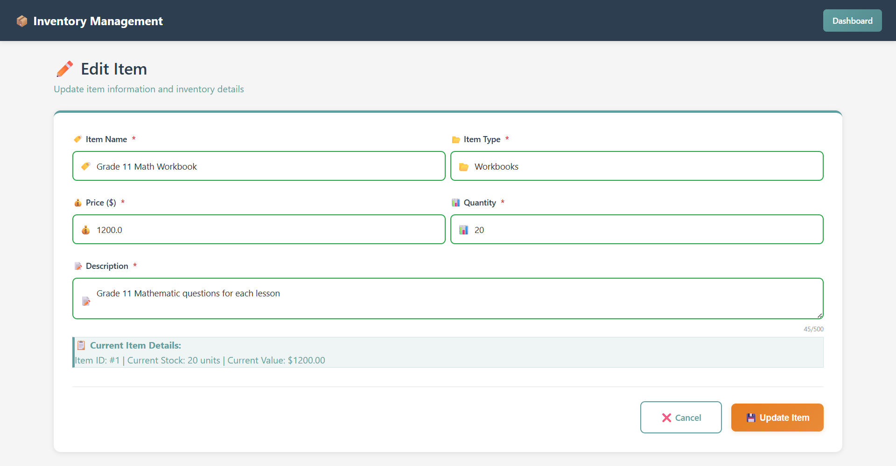

### 📌 Manage Items
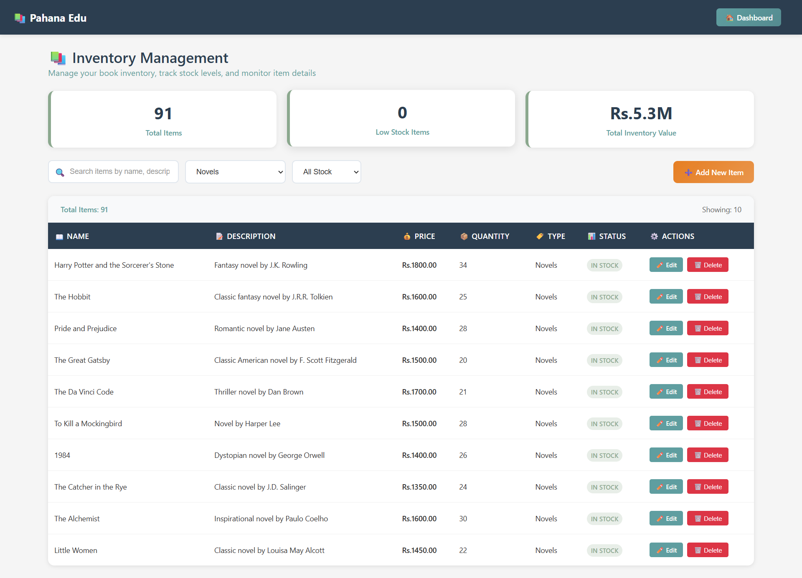

### 📌 Add Staff
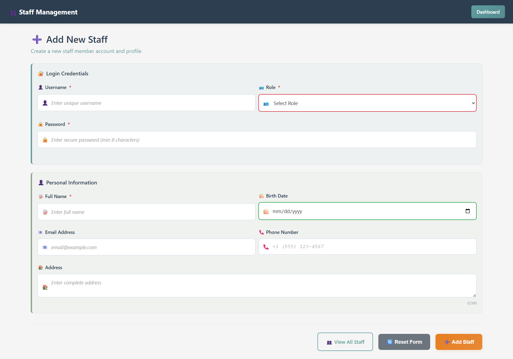

### 📌 Update Staff
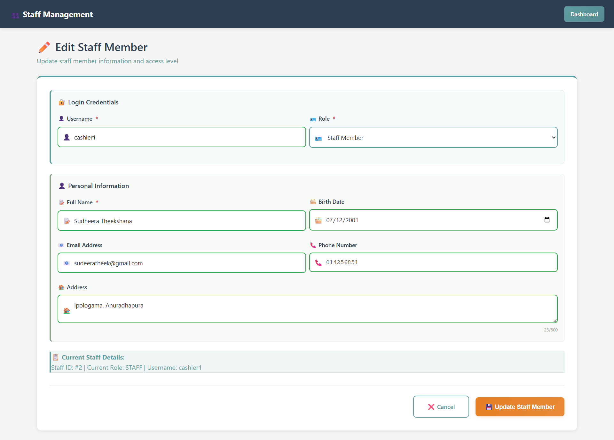

### 📌 Manage Staff
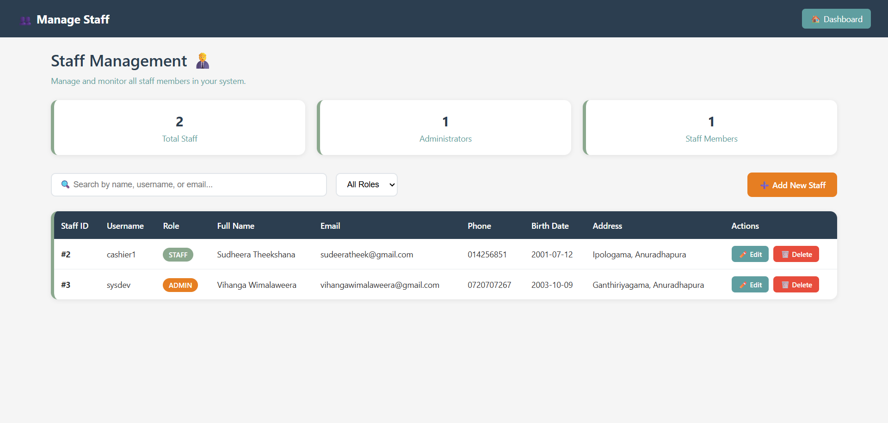

### 📌 Order Page
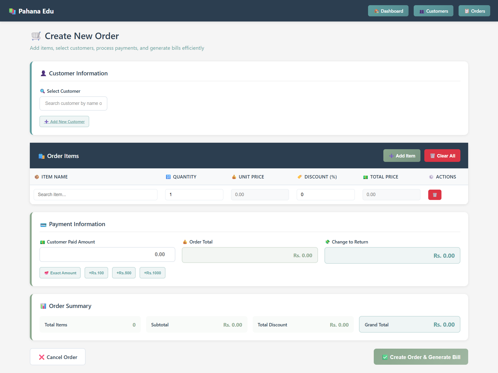

### 📌 Order Details
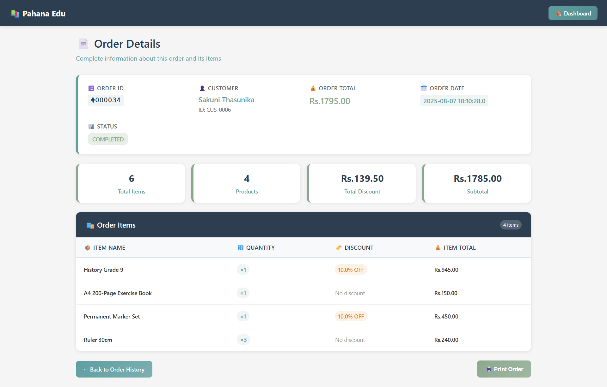

### 📌 Order History
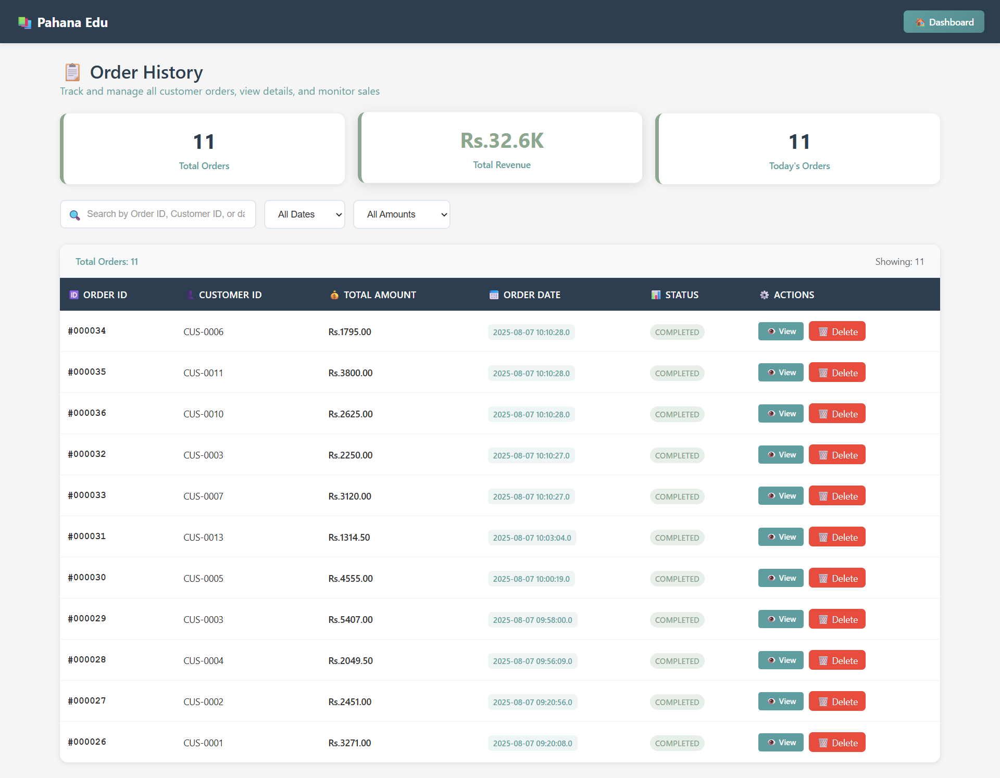

### 📌 Help
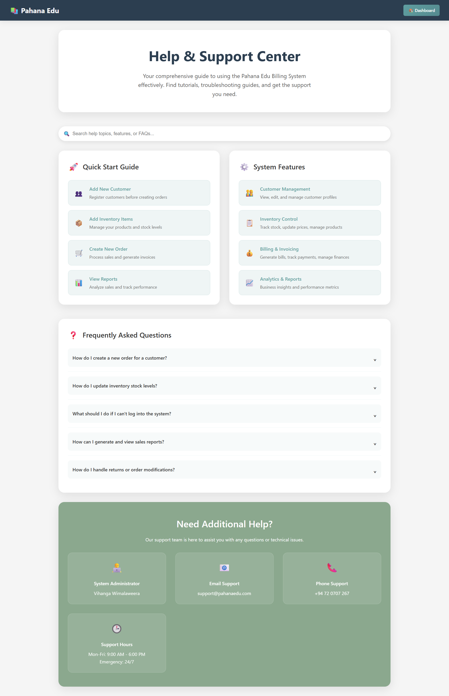


---

## 🚀 How to Run

1. Clone the repository:
   ```bash
   https://github.com/dazai2003/billing_system.git
   ```

2. Import into Eclipse as a **Maven Project**.

3. Configure Tomcat 9 server.

4. Create MySQL database and import the provided SQL dump.

5. Run on localhost and access via browser:
   ```http://localhost:8080/billing_system/login.jsp```

---

## 📬 Contact

For more info, contact: **Vihanga Wimalaweera**  
📧 vihangawimalaweera@gmail.com

---

> Developed as part of the Advanced Programming Assignment – 2025
